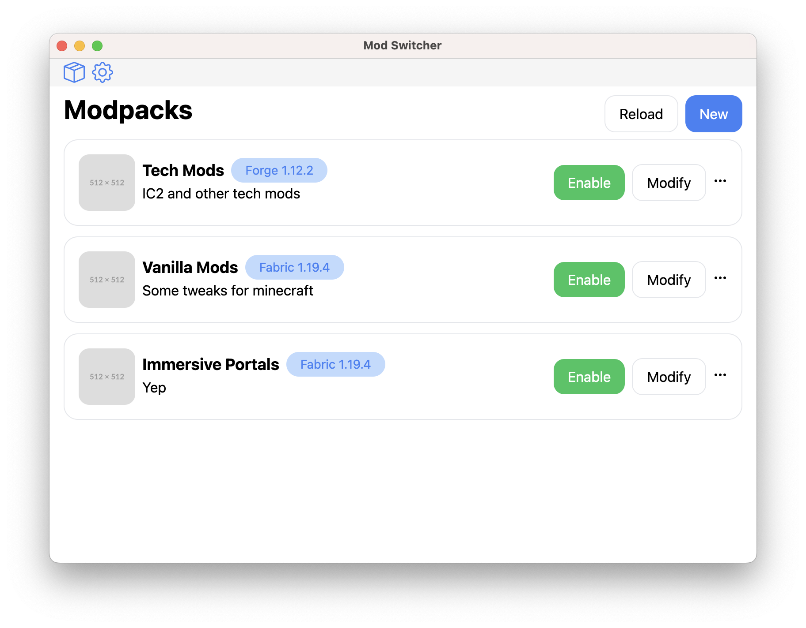

# Mod Switcher
Simple app for fast switching minecraft mods



## Installation
### Releases
Go to [Releases](https://github.com/Mon4ik/mod-switcher/releases) and download for your system

### Building
1. Clone repos
2. Install dependencies 
   ```shell
   yarn
   ```
3. Build it
   ```shell
   yarn app:build
   ```
4. Run app from `releases` folder